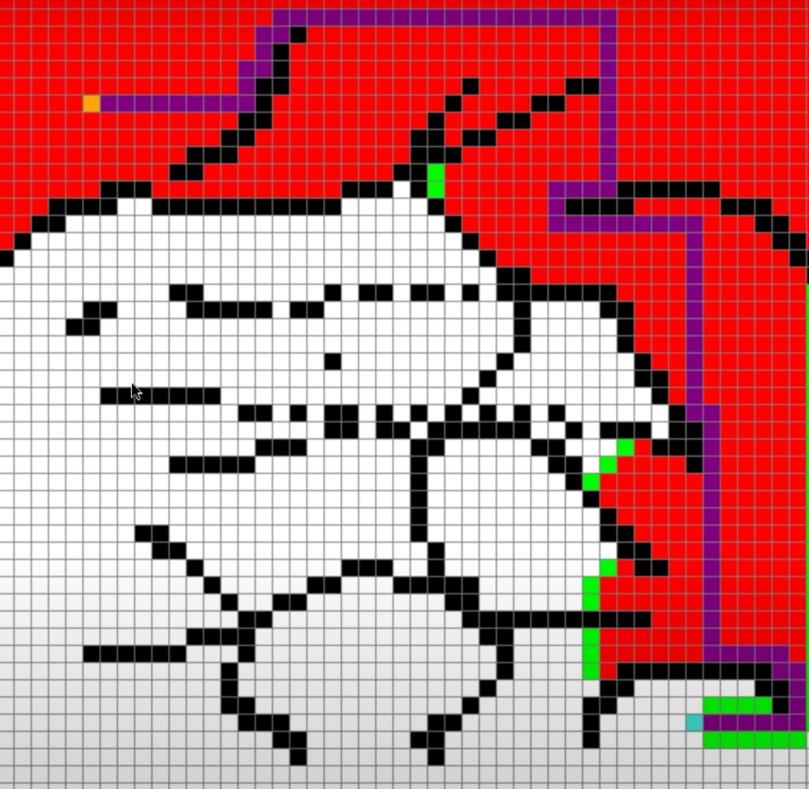

# 🧭 A* Pathfinding Visualization

A C implementation of the A* algorithm for pathfinding, visualized with SDL3.

## ⚙️ Technologies
- C
- SDL3

## 📌 Features
- A* pathfinding
- Real-time visualization
- Simple UI

## 📷 Screenshots

